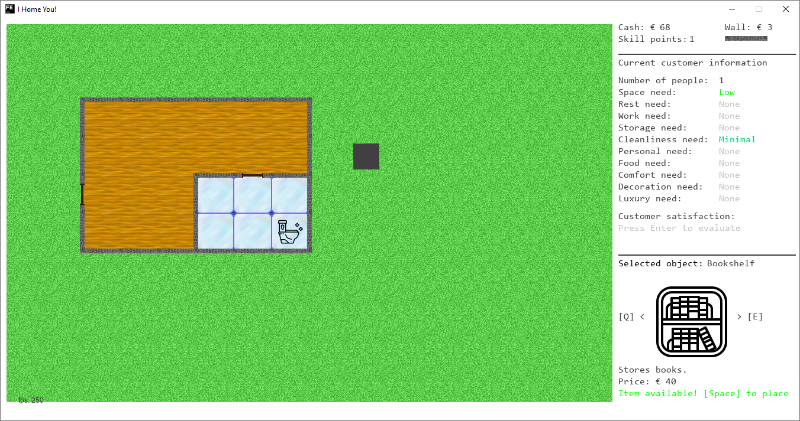
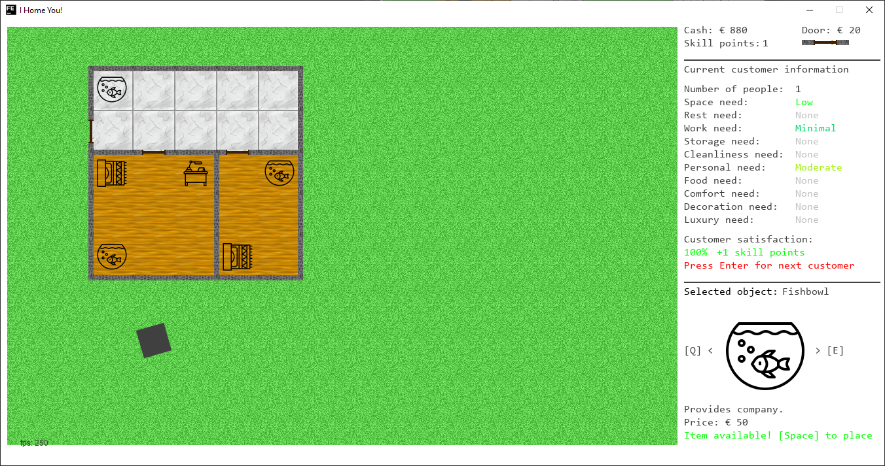
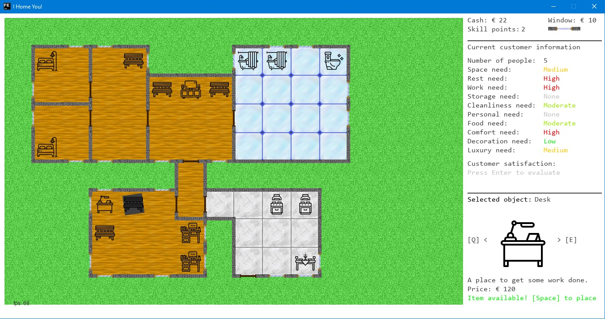

# I Home You!
## Story

Slip in the role of are a real estate architect who has to build the perfect home for the customers. Easy enough... But beware! Your clients range from frugal single person beggars to snobbish large families, self centered shared flat communities or religious church orders. They have 10 different needs you have to juggle the home around. And all of this on a low budget. And the best? Customers tell one another how you perform and will cut your budget on the next project. So, good luck!

## Objective

You will be asked to build flats for different customers. To do so, look at the customer needs on the right side of the screen.
Then, build a flat which you think satisfies those needs best. To accomplish this task, you will have to build walls and doors
and then place furniture in the different rooms that you have created. After you are happy with the flat, you can hand it over
to the customer which will then decide how happy they are with it. The happier they are, the more budget future customers will
pay you. To win the game, satisfy all customers. If a customer is satisfied less than 20%, you will lose the game. 

## Controls

| Key                 | Effect                            |
|---------------------|-----------------------------------|
| Up arrow (&uarr;)   | Move up                           |
| Left arrow (&larr;) | Move left                         |
| Down arrow (&darr;) | Move down                         |
| Right arrow (&rarr;)| Move right                        |
| W                   | Build top wall / window / door    |
| A                   | Build left wall / window / door   |
| S                   | Build bottom wall / window / door |
| D                   | Build right wall / window / door  |
| 1                   | Switch to walls (for WASD)        |
| 2                   | Switch to windows (for WASD)      |
| 3                   | Switch to doors (for WASD)        |
| Q                   | Go backwards in furniture list    |
| E                   | Go forward in furniture list      |
| Space               | Buy and place selected furniture  |
| U                   | Unlock selected furniture         |
| Enter               | Handover flat to customer         |

## Screenshots

## Background

This game has been created during the Global Game Jam 2019 at the jam site Leipzig, Germany.

## Credits

* Backend Graph Analysis - merando
* Graphics - IP
* Game Mechanics - SharkofMetal
* External assets used: [Furniture icon set](https://www.iconfinder.com/iconsets/furniture-180)
